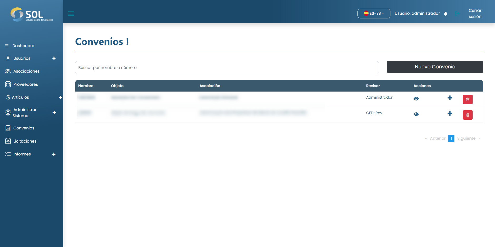

# Acuerdos

En la pestaña "Acuerdos", accesible a través del menú principal en la parte superior de la página, puede ver una lista de todos los Acuerdos registrados en el Sistema, ver detalles sobre ellos, editar la información, eliminar un Acuerdo o añadir uno nuevo.


Tenga en cuenta que si los datos del Acuerdo se han importado desde una integración, no podrá editarlos, independientemente de su Perfil de Administrador.


<figure><figcaption></figcaption></figure>

### ¿Cómo ver los detalles de un acuerdo?

Al hacer clic en el nombre de un Acuerdo, se accede a la página con los datos generales.


El "Plan de trabajo" es donde deben especificarse los elementos que se van a adquirir en ese Acuerdo. Para acceder a la página con estos elementos, basta con hacer clic en el enlace del plan de trabajo.


<figure><figcaption></figcaption></figure>
