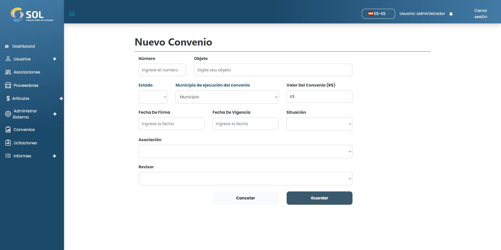

# Añadir Acuerdo

### ¿Cómo añado un nuevo acuerdo?

Para añadir un nuevo Pacto al Sistema, basta con hacer clic en el botón <mark style="color:blue;">**`Nuevo Acuerdo`**</mark>.

En el campo "Revisor", debe definir qué Perfil de Administrador Revisor será responsable de las ofertas y contratos vinculados a este nuevo Acuerdo.

<figure><figcaption></figcaption></figure>

Después de rellenar todos los campos, haga clic en <mark style="color:blue;">**`Crear Acuerdo`**</mark>.
