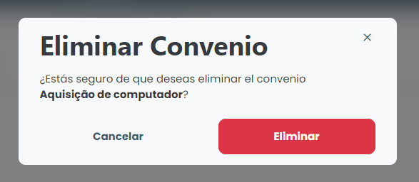

# Borrar Acuerdo

### ¿Cómo se suprime un artículo?

Para eliminar cualquier acuerdo registrado, basta con hacer clic en el icono de eliminación (basurero) disponible junto al nombre del acuerdo en la lista disponible en la pestaña "Acuerdos".

<figure><figcaption></figcaption></figure>

El sistema mostrará un modal de confirmación, simplemente haga clic en <mark style="color:blue;">**`Eliminar`**</mark> y ese artículo será eliminado del sistema.
