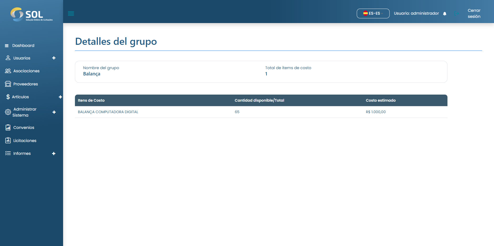

# Grupo de artículos

Al hacer clic en el nombre de un Acuerdo, se accede a la página con los datos generales.


El "Plan de trabajo" es donde deben especificarse los elementos que se van a adquirir en ese Acuerdo. Para acceder a la página con estos elementos, basta con hacer clic en el enlace del plan de trabajo.


<figure><figcaption></figcaption></figure>

### ¿Cómo ver los detalles de un grupo?

Si pulsa sobre uno de los grupos de la lista, el Sistema abre una pantalla con los datos de ese grupo.

<figure><figcaption></figcaption></figure>
