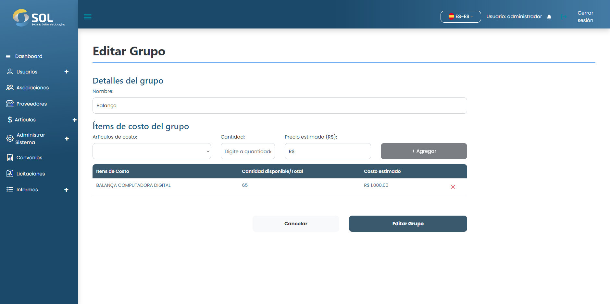

# Editar el grupo

### ¿Cómo editar un grupo?

Para editar la información de cualquier grupo de elementos registrados, basta con hacer clic en el icono de edición (lápiz) disponible junto al nombre del grupo en la lista disponible en la página "Datos del Acuerdo".

Para eliminar un artículo del grupo, basta con hacer clic en el icono de exclusión (X roja), situado junto al coste estimado del artículo. Repita esta operación tantas veces como sea necesario para eliminar tantos artículos como desee.

Para añadir nuevos artículos, basta con introducir las tres primeras letras del artículo en cuestión en el campo "Artículo de coste", y el Sistema mostrará una lista de todos los artículos que contengan esas letras.

A continuación, sólo tiene que seleccionar el artículo que desee, especificar la cantidad, el coste estimado y hacer clic en <mark style="color:blue;">**`Añadir`**</mark>. Repita esta operación tantas veces como sea necesario para completar su nuevo grupo de artículos.

<figure><figcaption></figcaption></figure>

Después de cambiar la información que necesita, haga clic en <mark style="color:blue;">**`Guardar`**</mark>. Los cambios se guardarán y el grupo se actualizará.
