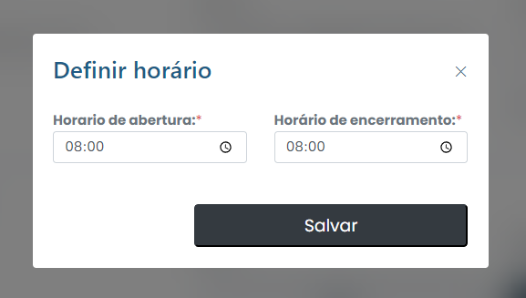

# Establecer horario

## ¿Cómo establecer un horario?&#x20;

Para establecer un horario, simplemente haga clic en la pestaña Establecer horarios en el menú.

<figure><figcaption></figcaption></figure>

Luego, configure la información necesaria y haga clic en "Guardar". Se guardarán los cambios y se confirmará el horario.
