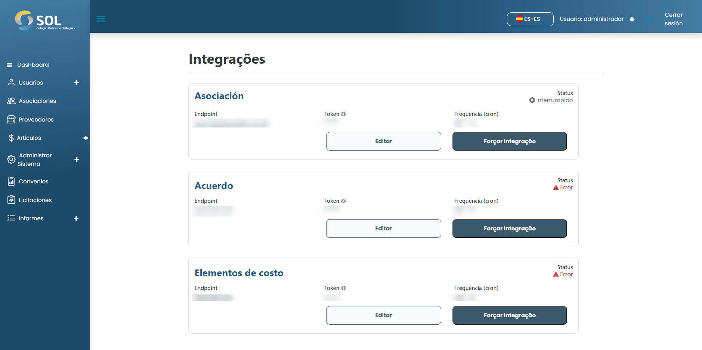
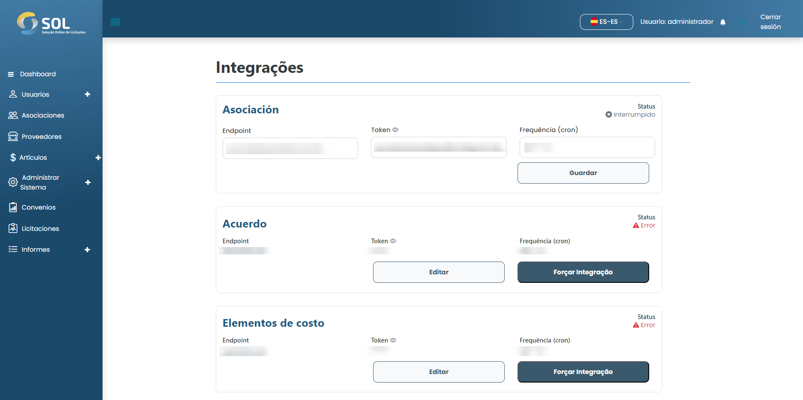

# Integraciones

En la pestaña "Integración", accesible a través del menú principal en la parte superior de la página, puede ver una lista de todas las Integraciones en el Sistema, editar su información y forzar la integración.&#x20;

SOL verifica la información del sistema que se integró y actualiza la información de Membresía, Convenio y Elementos de Costo en la base de datos.


Frecuencia de integración:&#x20;

Para programar la tarea de actualizar la base de datos en la integración, se utiliza una expresión cron para crear la recurrencia.

[https://crontab.cronhub.io/](https://crontab.cronhub.io/)


<figure><figcaption></figcaption></figure>

## ¿Cómo editar una integración?&#x20;

Para editar una integración, simplemente haga clic en la edición disponible junto al nombre de la integración en la lista de la pestaña "Integraciones".&#x20;

<figure><figcaption></figcaption></figure>

Luego haga los cambios necesarios usando puntos finales y tokens válidos, luego haga clic en "Guardar". Los cambios se guardarán y la integración se actualizará.

## ¿Cómo forzar la integración?&#x20;

Para forzar una integración, primero debe editar la integración utilizando los puntos finales y tokens requeridos y luego hacer clic en forzar integración, por lo que el estado cambiará a "En progreso".
