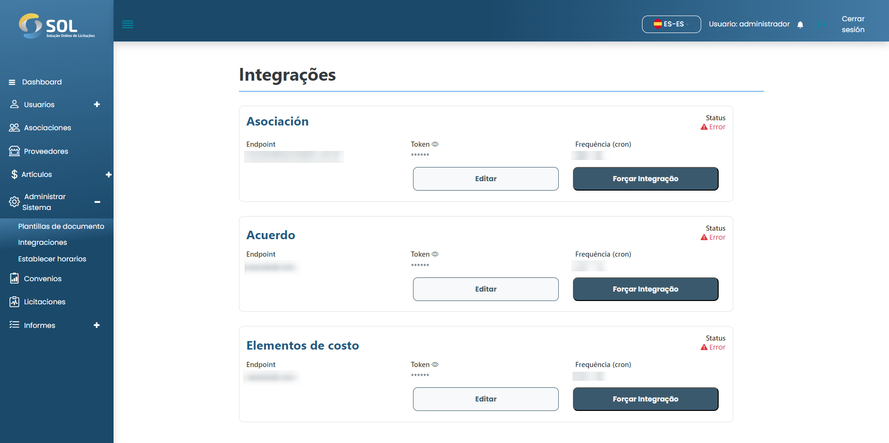

# Integraciones

En la pestaña "Integración", accesible a través del menú principal en la parte superior de la página, puede ver una lista de todas las Integraciones en el Sistema, editar su información y forzar la integración.

<figure><figcaption></figcaption></figure>
