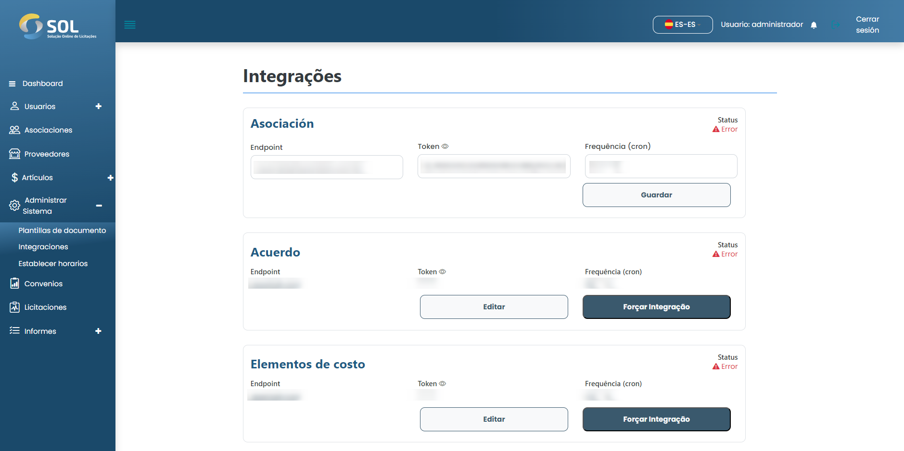

# Editar integración

## ¿Cómo editar una integración?&#x20;

Para editar una integración, simplemente haga clic en la edición disponible junto al nombre de la integración en la lista de la pestaña "Integraciones".

<figure><figcaption></figcaption></figure>

Luego haga los cambios necesarios y haga clic en "Guardar". Los cambios se guardarán y la integración se actualizará.
