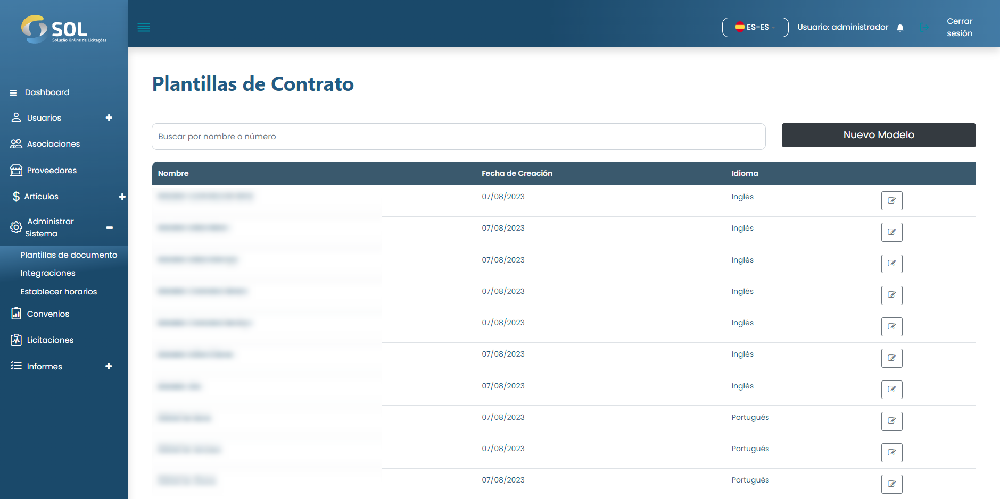

# Modelo de documento

En la pestaña "Plantillas de documentos", accesible a través del menú principal en la parte superior de la página, es posible ver una lista de todas las plantillas de documentos registradas en el Sistema, editar su información.

<figure><figcaption></figcaption></figure>
