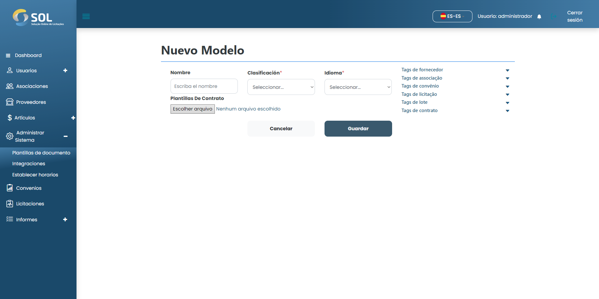

# Nuevo modelo

## ¿Cómo agregar un nuevo modelo?&#x20;

Para agregar un modelo al Sistema, simplemente haga clic en el botón "Nuevo Modelo". Luego llene los campos requeridos.

<figure><figcaption></figcaption></figure>

