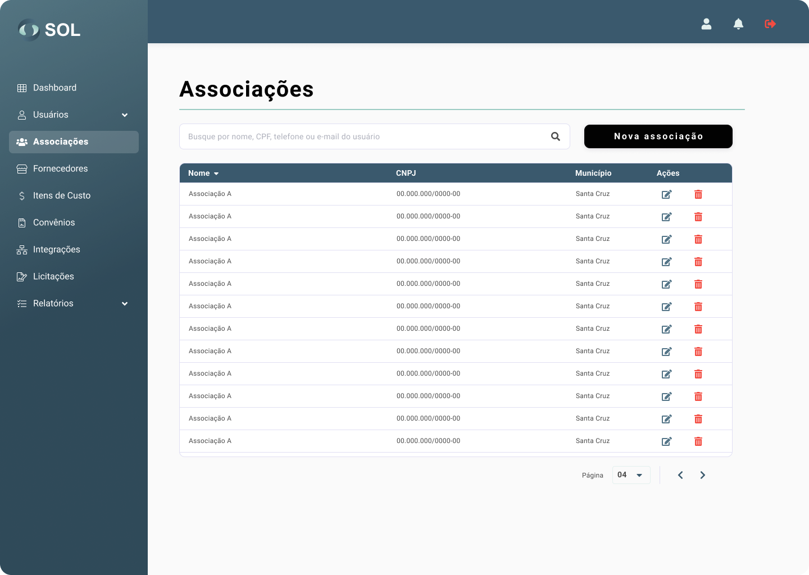

# Asociaciones

En la pestaña "Asociaciones", accesible a través del menú principal en la parte superior de la página, puede ver una lista con todas las Asociaciones registradas en el Sistema, ver detalles sobre ellas, editar la información, eliminar una Asociación o añadir una nueva Asociación.

<figure><figcaption></figcaption></figure>


Cabe señalar que si los datos de la Asociación se han importado de una integración, no se pueden editar, independientemente de cuál sea su Perfil de Administrador.


### ¿Cómo ver los detalles de la asociación?

Haciendo clic en el nombre de una Asociación, podrá acceder a su página de datos generales, incluidos los acuerdos a los que está vinculada actualmente y el Revisor responsable de sus licitaciones y contratos.

<figure><figcaption></figcaption></figure>
