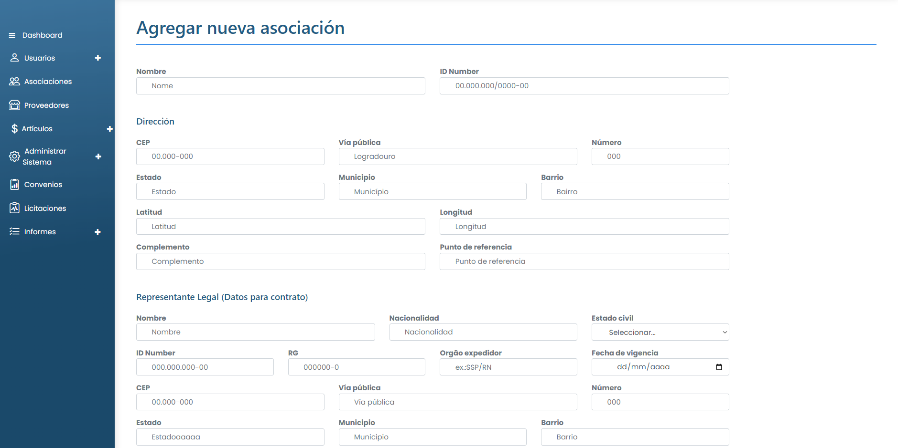

# Añadir asociación

### ¿Cómo añadir una nueva asociación?

Para añadir una nueva Asociación al Sistema, simplemente haga clic en el botón <mark style="color:blue;">**`Nueva Asociación`**</mark>. A continuación, sólo tiene que rellenar los campos solicitados.

<figure><figcaption></figcaption></figure>

Una vez rellenados todos los campos, haga clic en <mark style="color:blue;">**`Crear asociación`**</mark>.
