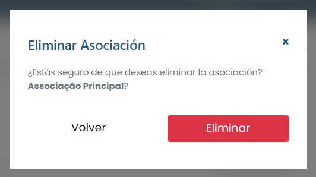

# Borrar asociación

### ¿Cómo eliminar una asociación?

Para excluir cualquier asociación registrada, basta con hacer clic en el icono de exclusión (basurero) disponible junto al nombre de la asociación en la lista disponible en la pestaña "Asociación".

<figure><figcaption></figcaption></figure>

El sistema mostrará un modal de confirmación, simplemente haga clic en <mark style="color:blue;">**`Eliminar`**</mark> y esa asociación será eliminada del sistema.
