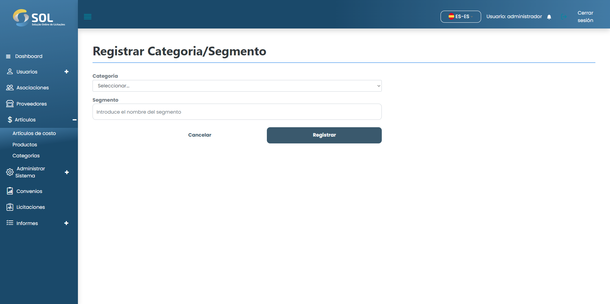

# Añadir categorias

### ¿Cómo añadir uns nueva categoria?

Para añadir una nueva categoria al Sistema, simplemente haga clic en el botón Nueva categoria. A continuación, rellene los campos necesarios.

<figure><figcaption></figcaption></figure>

Después de rellenar todos los campos, haga clic en <mark style="color:blue;">**`Guardar`**</mark>.
