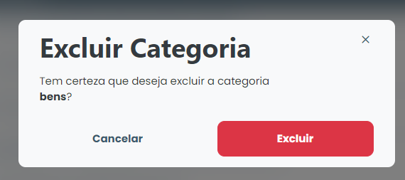

# Borrar categoria

### ¿Cómo se suprime una categoria?

Para suprimir una categoria registrado, basta con hacer clic en el icono de supresión (papelera) disponible junto al nombre del categoria en la lista disponible en la pestaña "Categorias".

<figure><figcaption></figcaption></figure>

El sistema mostrará un modal de confirmación, simplemente haga clic en <mark style="color:blue;">**`Eliminar`**</mark> y él será eliminado del sistema.
