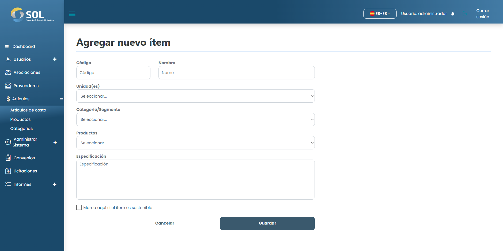

# Añadir artículo

### ¿Cómo añadir un nuevo elemento de costo?

Para añadir un nuevo artículo de coste al Sistema, simplemente haga clic en el botón Nuevo artículo. A continuación, rellene los campos necesarios.

<figure><figcaption></figcaption></figure>

Después de rellenar todos los campos, haga clic en <mark style="color:blue;">**`Crear elemento`**</mark>.
