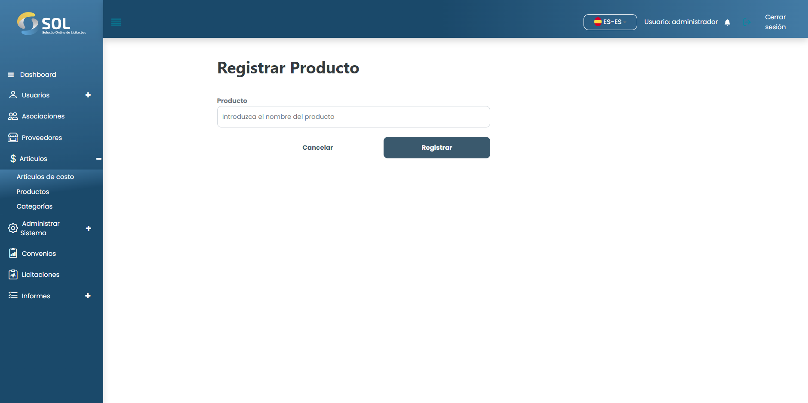

# Añadir producto

### ¿Cómo añadir un nuevo producto?

Para añadir un nuevo producto al Sistema, simplemente haga clic en el botón Nuevo producto. A continuación, rellene los campos necesarios.

<figure><figcaption></figcaption></figure>

Después de rellenar todos los campos, haga clic en <mark style="color:blue;">**`Guardar`**</mark>.
