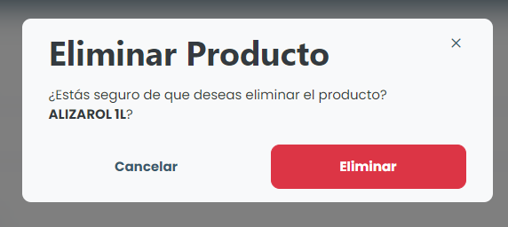

# Borrar producto

### ¿Cómo se suprime un producto?

Para suprimir un elemento de coste registrado, basta con hacer clic en el icono de supresión (papelera) disponible junto al nombre del elemento en la lista disponible en la pestaña "Elementos de costo".

<figure><figcaption></figcaption></figure>

El sistema mostrará un modal de confirmación, simplemente haga clic en <mark style="color:blue;">**`Eliminar`**</mark> y él será eliminado del sistema.
