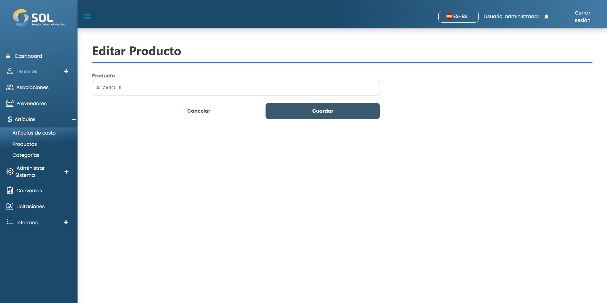

# Editar producto

### ¿Cómo edito un producto registrado?

Para editar la información de cualquier producto registrado, basta con hacer clic en el icono de edición (lápiz) disponible junto al nombre del elemento en la lista disponible en la pestaña "Productos".

<figure><figcaption></figcaption></figure>

Después cambie la información que necesite y haga clic en <mark style="color:blue;">**`Guardar.`**</mark> Los cambios se guardarán y el artículo se actualizará.
