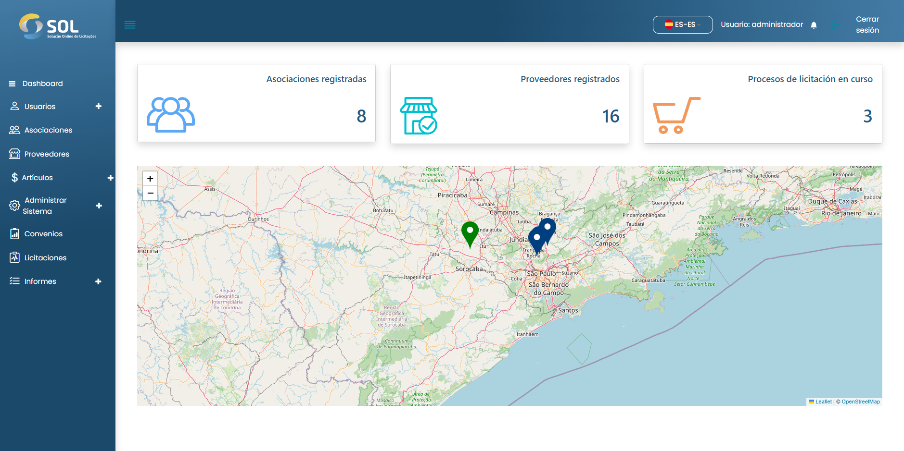

# Dashboard


Al acceder a la plataforma SOL, se le dirige al panel inicial del Sistema (Dashboard).


<figure><figcaption></figcaption></figure>

En esta pantalla, verá las pestañas disponibles en el menú principal:&#x20;

* Panel&#x20;
* Usuarios&#x20;
  * Asociación&#x20;
  * Proveedores&#x20;
  * Administración&#x20;
* Asociaciones&#x20;
* Proveedores&#x20;
* Elementos&#x20;
  * elementos de costo&#x20;
  * productos&#x20;
  * Categorías&#x20;
* Administrar sistema&#x20;
  * Plantillas de documentos
  * integraciones&#x20;
  * establecer horarios&#x20;
* Acuerdos&#x20;
* Ofertas&#x20;
* Informes (En desarrollo)&#x20;
  * Ofertas&#x20;
  * Contratos&#x20;
  * informes generales&#x20;
  * Informes generados

También tiene acceso a su perfil y a las notificaciones del sistema - representadas por los iconos de una persona y una campana, respectivamente-, además del mapa, con la indicación de los suministradores con puntos en verde y las asociaciones con puntos en azul. Encima del mapa, en tres zonas, se indica el número de asociaciones y suministradores registrados en la plataforma y el número de licitaciones en curso.

En el mapa, puede hacer clic en los suministradores y asociaciones registrados. Al hacer clic en el punto de un suministrador, se le dirige a una nueva pantalla con su respectiva información.
