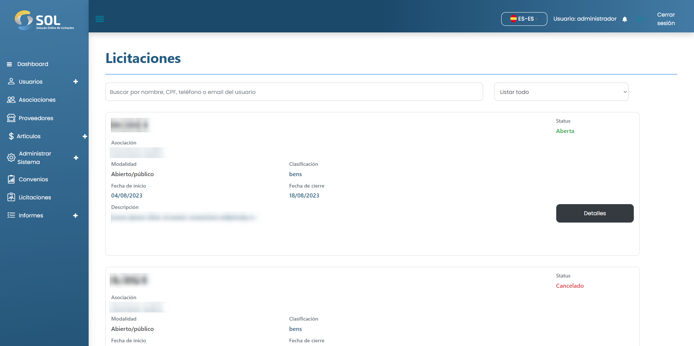
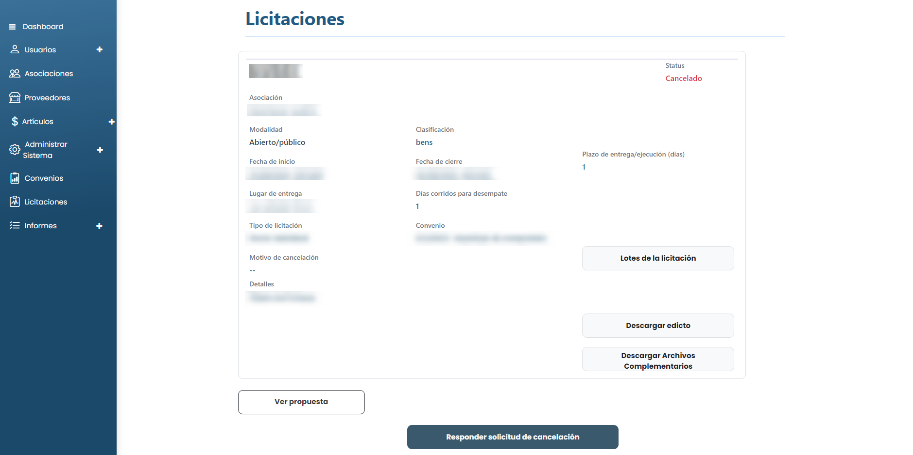

# Licitaciones

En la pestaña "Licitaciones", accesible a través del menú principal en la parte superior de la página, puede ver una lista con todas las licitaciones registradas en el Sistema, incluso las ya finalizadas.

<figure><figcaption></figcaption></figure>

### ¿Cómo ver los detalles de una licitación?

Para acceder a la información completa sobre una licitación, basta con hacer clic en el botón <mark style="color:blue;">**`Detalle`**</mark> disponible en el marco de la licitación.


El Administrador puede realizar acciones como liberar la licitación y aprobar, o rechazar la elección entre las propuestas realizadas por la Asociación. Por regla general, no realiza ninguna de estas acciones, ya que son funciones del Revisor que asigna a cada acuerdo. Por ello, en todos los puntos relativos a licitaciones, este manual se referirá al perfil del Revisor.


<figure><figcaption></figcaption></figure>
