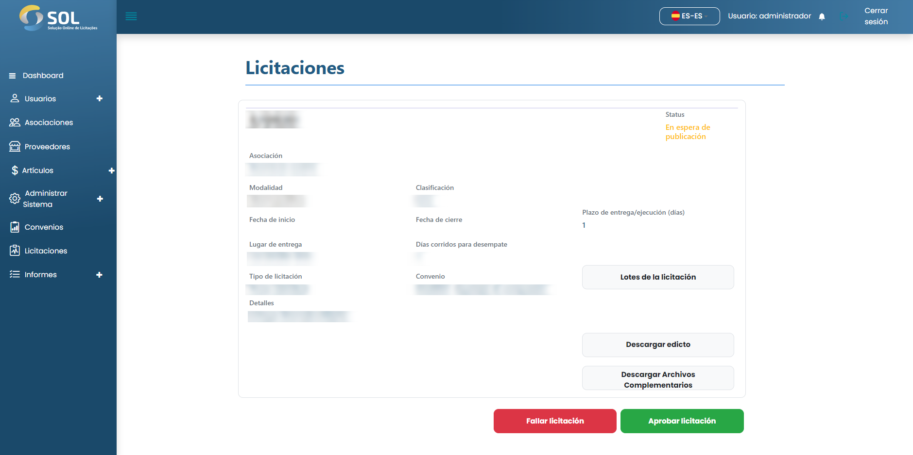

# Publicar/Rechazar licitación

### ¿Cómo liberar o rechazar una licitación?

Acuando acceda a los detalles de una licitación cuyo estado sea "En espera de publicación", puede hacer clic en <mark style="color:blue;">**`Publicar licitación`**</mark> o <mark style="color:blue;">**`Rechazar licitación`**</mark>.

<figure><figcaption></figcaption></figure>

Si ha optado por rechazar la oferta, deberá cumplimentar y describir el motivo del rechazo.

<figure><figcaption></figcaption></figure>

Después de rellenar la justificación, basta con hacer clic en <mark style="color:blue;">**`Rechazar licitación.`**</mark>
