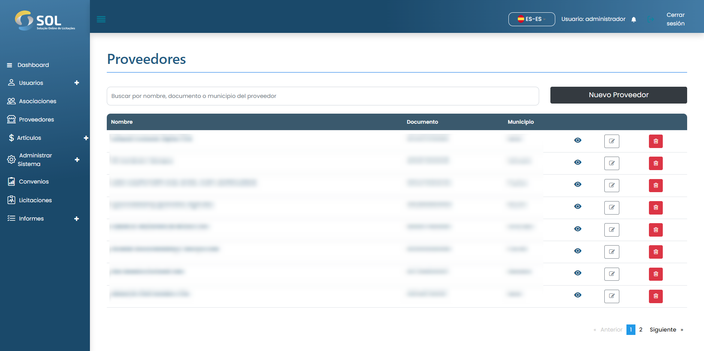
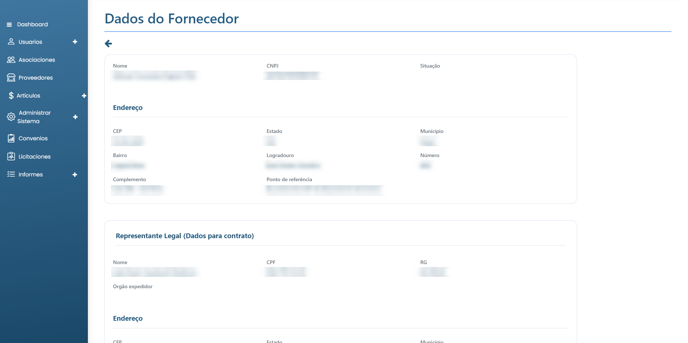

# Suministradores

En la pestaña " Suministradores ", accesible a través del menú principal en la parte superior de la página, puede ver una lista con todos los Suministradores registrados en el Sistema, ver detalles sobre ellos, editar la información, eliminar un Suministrador o añadir uno nuevo.

<figure><figcaption></figcaption></figure>

### ¿Cómo ver los datos de un suministrador?

Al hacer clic en el nombre de un suministrador, se accede a la página con los datos generales, incluidas las categorías a las que puede suministrar productos.

<figure><figcaption></figcaption></figure>
