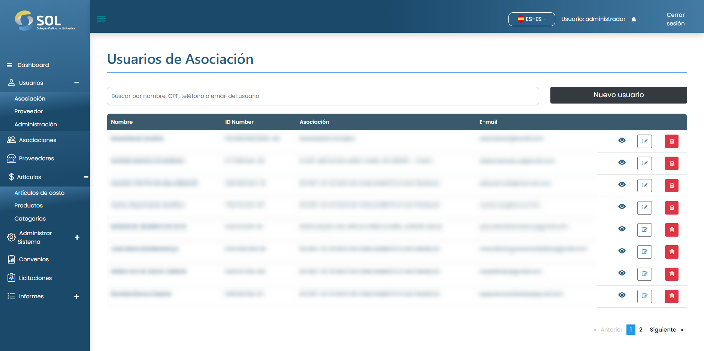

# Usuarios de Asociación

Para acceder a la lista de usuarios de la asociación, haga clic en el menú lateral en <mark style="color:blue;">**`Usuarios`**</mark> y seleccione <mark style="color:blue;">**`Asociación`**</mark>.&#x20;

La lista muestra la información Nombre, Correo electrónico, CPF (NIE) /CNPJ (RUC) y Asociación. Es posible realizar búsquedas por texto utilizando la información de la lista.

<figure><figcaption></figcaption></figure>
