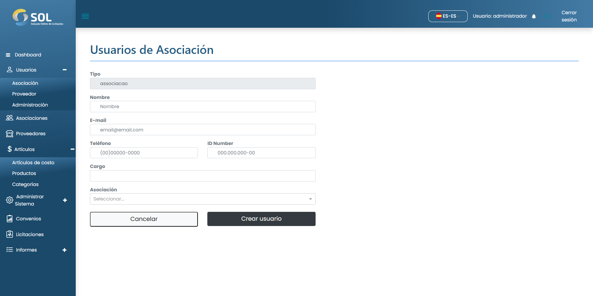

# Registrar un usuario

### ¿Cómo registrar un nuevo usuario?

Para añadir un usuario de la **Asociación**, basta con hacer clic en el botón <mark style="color:blue;">**`Nuevo usuario`**</mark> y rellenar los campos existentes en la página que se abrirá a continuación.


En el campo "Asociación", debe escribir al menos las tres primeras letras del nombre de una Asociación. Con esto, el Sistema mostrará una lista con todas las asociaciones que contengan esas letras. El mismo proceso debe repetirse para rellenar el campo "Puesto".


<figure><figcaption></figcaption></figure>

Después de rellenar todos los campos, haga clic en <mark style="color:blue;">**`Crear usuario`**</mark>.
