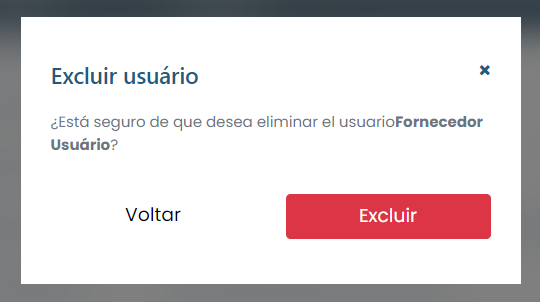

# Borrar usuario

### ¿Cómo eliminar un usuario?

Para eliminar un usuario registrado, basta hacer clic en el icono de eliminación (basurero) disponible junto al nombre del perfil en la lista disponible en la pestaña "Usuarios".

El sistema mostrará un modal de confirmación, simplemente haga clic en <mark style="color:blue;">**`Eliminar`**</mark> y ese usuario será eliminado del sistema.

<figure><figcaption></figcaption></figure>
