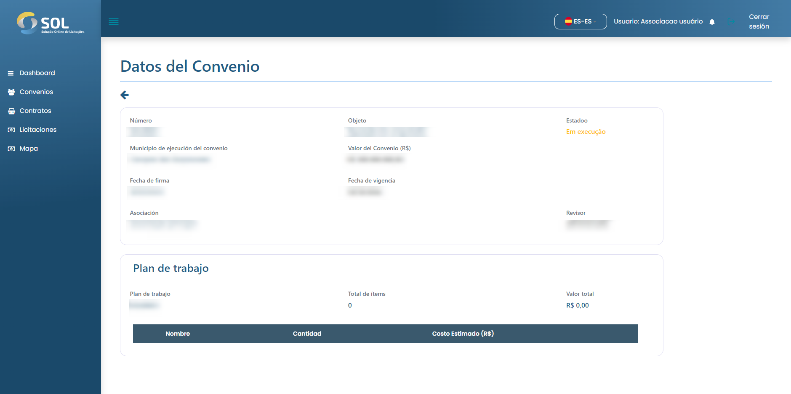

# Acuerdos

Haciendo clic en la pestaña " Acuerdos ", se accede a la pantalla principal de acuerdos del Sistema. La página muestra un resumen de los convenios realizados hasta la fecha y su estado actual.

<figure><figcaption></figcaption></figure>

### ¿Cómo ver los detalles de un acuerdo?

Si desea acceder a los detalles de un acuerdo, simplemente haga clic en el que desea ver. Una vez en la página de un acuerdo específico, titulada "Acuerdo", puede acceder a sus detalles. La información se establece en el momento en que se crea un acuerdo.

<figure><figcaption></figcaption></figure>
