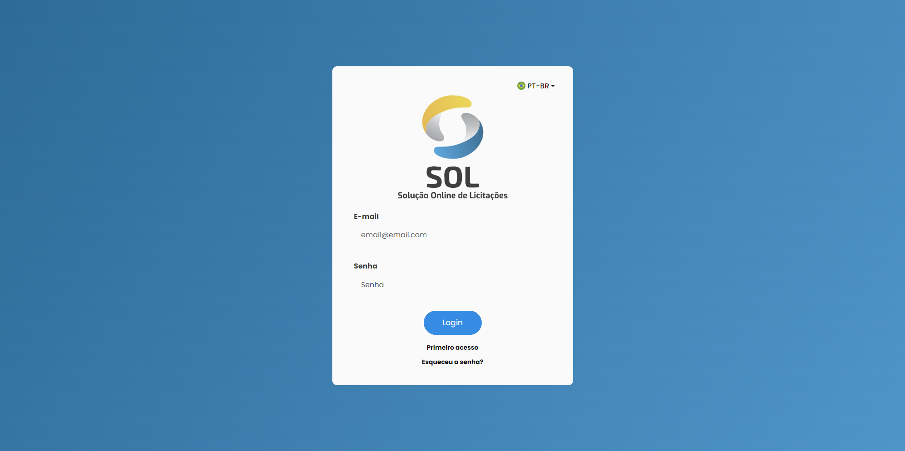

# Control de acceso

### Conectarse a la plataforma

El usuario registrado accede a la plataforma con el correo electrónico y la contraseña. Sólo el administrador puede registrar nuevos usuarios.


Link:



<figure><figcaption></figcaption></figure>

### He olvidado mi contraseña

Para recuperar el acceso, haga clic en la pantalla de inicio de sesión en <mark style="color:blue;">**`¿Ha olvidado su contraseña?`**</mark>

Introduzca la dirección de correo electrónico registrada y haga clic en <mark style="color:blue;">**`Confirmar`**</mark>

<figure><figcaption></figcaption></figure>

Recibirás un código para validar tu correo electrónico. Introduzca el código y haga clic en <mark style="color:blue;">**`Continuar.`**</mark>

Con el código validado cree una nueva contraseña y confirme la nueva contraseña. Haga clic en <mark style="color:blue;">**`Continuar`**</mark>.

Listo, ¡ya puedes iniciar sesión con tu nueva contraseña!
