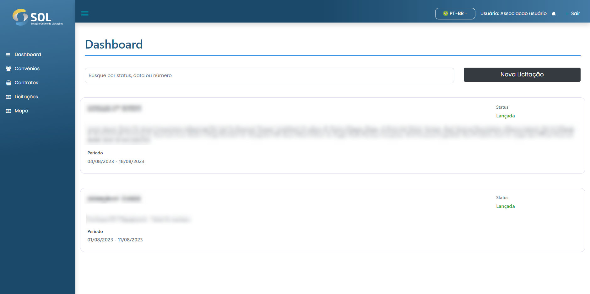

# Dashboard

<figure><figcaption></figcaption></figure>


Al acceder a la plataforma SOL, se le dirige al panel inicial del Sistema (Dashboard).


En esta pantalla de inicio podrá ver un resumen de su perfil: su información personal y las últimas pujas abiertas. Además, en la página de inicio puede crear una puja haciendo clic en el botón <mark style="color:blue;">**`Nueva licitación`**</mark>.


Para cada oferta mostrada, tenemos acceso a las diez últimas ofertas abiertas y podemos ver la información principal sobre los documentos. Éstos son:

* El título de la licitación;
* La situación en la que se encuentra (estatus);
* Periodo de tiempo que permanecerá abierta.

Para ver todas las ofertas, aparte de las más recientes, basta con hacer clic en el botón <mark style="color:blue;">**`Buscar licitaciones.`**</mark>


También tienes acceso a tu perfil y a las notificaciones del sistema, representadas por los iconos de persona y campana, respectivamente.


#### Revisión del proceso de licitación

Tras crear la oferta, el estado cambia a "A la espera de publicación", como se muestra en la imagen inferior. A continuación, el Revisor de acuerdos comprobará si los datos introducidos en la oferta son correctos, así como la información de los lotes y artículos.



#### Proceso de concesión de licencias

Si todos los datos de la oferta son correctos, el Revisor la liberará. En ese momento, la oferta tendrá el estado "Liberada". El perfil de la Asociación recibirá una notificación cuando se produzca el cambio de estado.&#x20;

Cuando se libera la oferta, el edital de la misma está disponible para su visualización y descarga. Para acceder a él, basta con hacer clic en el botón "Descargar edital" disponible en la misma pantalla mostrada anteriormente.



#### Licitación abierta

En cuanto llegue la fecha de inicio de la licitación, fijada por la Asociación en el momento de su creación, la licitación pasará al estado "Abierta". Sólo después de la "Fecha de inicio" podrán los proveedores presentar ofertas para la licitación.



#### Licitación rechazada

Si es necesario corregir algún dato de la oferta, el revisor del acuerdo la rechazará. Siempre que esto ocurra, deberá especificar el motivo del rechazo. Automáticamente, el estado de la oferta vuelve a "En borrador" y se muestra un mensaje a la Asociación.


La Asociación siempre será notificada de los cambios en el estado de las ofertas creadas. Los cambios se presentan en la pestaña "Notificaciones", a la que se accede desde el menú principal.
