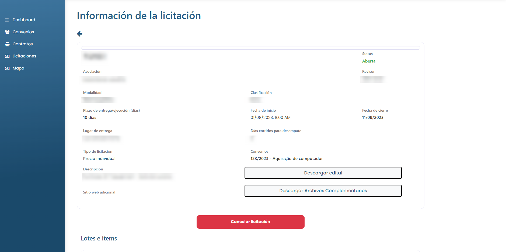

# Cancelar licitación

### ¿Cómo anular una licitación?

La Asociación puede solicitar la anulación de una oferta en cualquier momento, siempre que esté abierta. Para ello, basta con acceder a la oferta y hacer clic en el botón <mark style="color:blue;">**`Cancelar licitación`**</mark>.

A continuación, deberá indicar el motivo de la solicitud de anulación. Tras informar del motivo, haga clic en <mark style="color:blue;">**`Enviar solicitud de cancelación`**</mark>.

<figure><figcaption></figcaption></figure>


El Revisor de acuerdos puede aceptar la solicitud de cancelación o rechazarla. Si la acepta, el estado de la oferta será "Cancelada"; si no la acepta, el estado de la oferta seguirá siendo el mismo.

