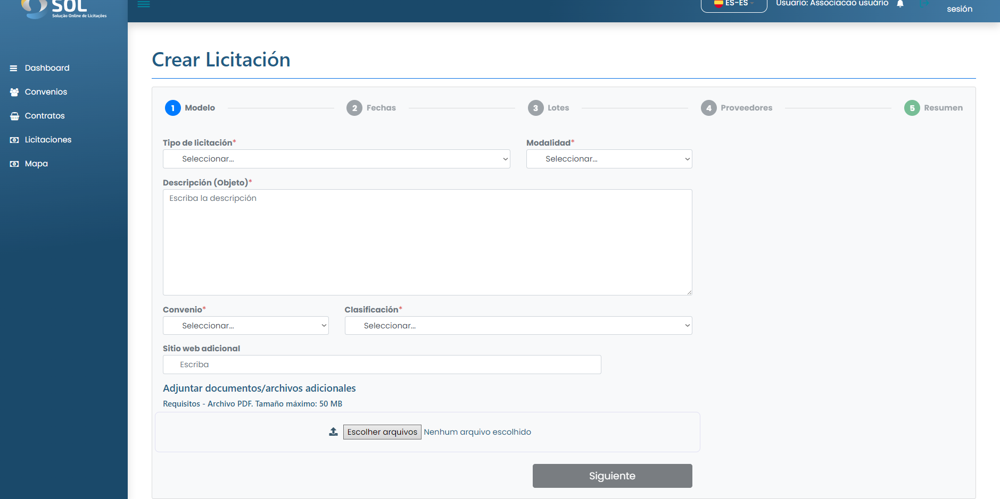

# Nueva licitación

### ¿Cómo crear una nueva licitación?

Para crear una nueva oferta, simplemente haga clic en el botón Crear oferta. Se le dirigirá a la pantalla "Nueva Oferta", en la que deberá completar toda la información solicitada en todas las etapas del registro.


Clasificación de la licitación:

* **Bienes:** se trata de licitaciones para la compra de materiales como material de oficina (impresoras, ordenadores, bolígrafos y papel);
* **Construcción**: son los destinados a la compra de materiales para llevar a cabo la construcción, como ladrillos, cemento o arena;
* **Servicio**: son las destinadas a la contratación de servicios como, por ejemplo, la matriculación de vehículos o el trabajo de albañil.



Tipo de licitación:

* **Precio individual:** cada lote puede tener un solo artículo. En este tipo, los proveedores pueden enviar propuestas específicas para cada partida, sin la obligación de enviar propuestas para todas. Al final del proceso de licitación, la Asociación podrá aceptar propuestas de diferentes proveedores en cada partida;
* **Precio por lote**: cada lote puede tener varios artículos. En este tipo de licitación, los proveedores deberán presentar sus propuestas por lote, contemplando todos los artículos incluidos en el mismo. Asimismo, la Asociación aceptará propuestas por lote. Si la licitación tiene dos o más lotes, puede elegir diferentes proveedores entre los lotes, de acuerdo con el mejor valor de la propuesta;
* **Precio global**: el Proveedor estará obligado a presentar una propuesta que abarque todos los lotes y todos los artículos enumerados en la oferta, y un único Proveedor deberá suministrar todos los productos, bienes o servicios licitados.



Modalidad de la licitación:

* **Abierta/Pública**: la licitación es pública y puede ser vista por todos los proveedores, que pueden enviar propuestas. Todos los Proveedores registrados que sean compatibles con la clasificación y el segmento de la licitación recibirán una notificación informando de la apertura. Además, la Asociación puede enviar invitaciones a los Proveedores registrados;
* **Invitación abierta**: la licitación puede ser consultada por todos los proveedores. Cualquier proveedor puede participar en la licitación, pero la Asociación envía invitaciones directas a proveedores específicos elegidos por ella, que reciben una notificación con la invitación. Si algún proveedor solicita participar, la solicitud es aceptada automáticamente por el sistema;
* **Invitación cerrada:** sólo los proveedores invitados pueden ver o participar en la licitación. La Asociación gestiona la invitación sólo a los proveedores que desea que participen en la licitación creada. Si el Proveedor invitado decide participar en la licitación, deberá presentar una propuesta que no podrá ser editada posteriormente.


<figure><figcaption></figcaption></figure>

A continuación, simplemente haga clic en <mark style="color:blue;">**`Crear licitación`**</mark> y su oferta se creará como "Borrador".

Mientras el estado de la oferta es "En borrador", es posible pulsar el botón "Editar" para modificar todos los campos excepto "Tipo de oferta" y "Modalidad", que no pueden modificarse. Además, mientras la oferta se encuentre en estado "En borrador", es posible eliminarla pulsando el botón "Eliminar".
