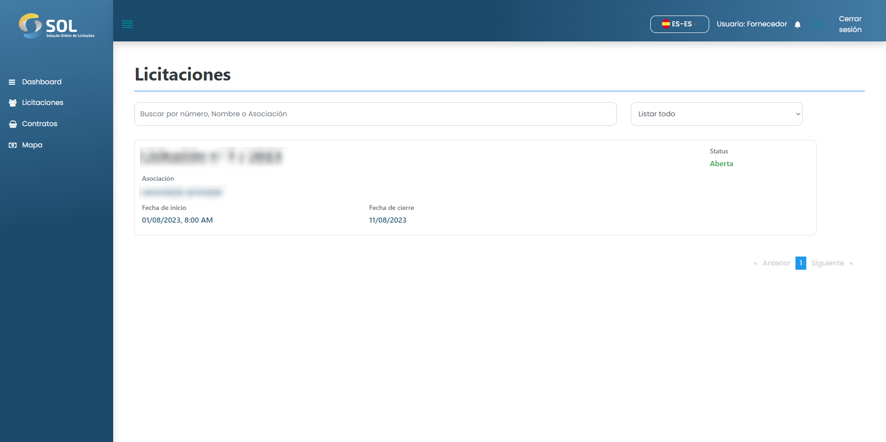

# Licitaciones

En la pestaña "Ofertas", accesible a través del menú principal o haciendo clic en la página de inicio del Sistema, se le dirige a la pestaña "Ofertas", donde puede ver una lista de todas las ofertas en las que participa el proveedor, incluso aquellas ya concluido.

<figure><figcaption></figcaption></figure>

### Tipos de licitación


### Abierta/pública

La licitación es pública y cualquier proveedor puede presentar ofertas. Una vez abierta, está disponible en la página principal de proveedores y también en la página "Licitaciones".



### Invitación abierta

Como en el caso anterior, cualquier Proveedor puede participar en la licitación, pero la Asociación envía las invitaciones directamente a los proveedores concretos elegidos por ella, que reciben una notificación automática. Al aceptar la invitación, el Proveedor participa automáticamente en la licitación.



### Invitación cerrada

Las ofertas de la modalidad "Invitación cerrada" sólo son visibles para los Proveedores invitados por la Asociación responsable. No hay otra forma de acceder a estas ofertas que a través de la invitación de la Asociación.

Las únicas diferencias entre las ofertas presentadas para "Invitación cerrada" y las demás ofertas es que, en este último caso, la oferta no puede modificarse después de su presentación y, si se retira, el Proveedor no puede presentar una nueva oferta.


### ¿Cómo ver los detalles de una licitación?

Para acceder a la información completa sobre una oferta, basta con hacer clic en ella en la página de inicio del Sistema o en el área de ofertas.

<figure><figcaption></figcaption></figure>
