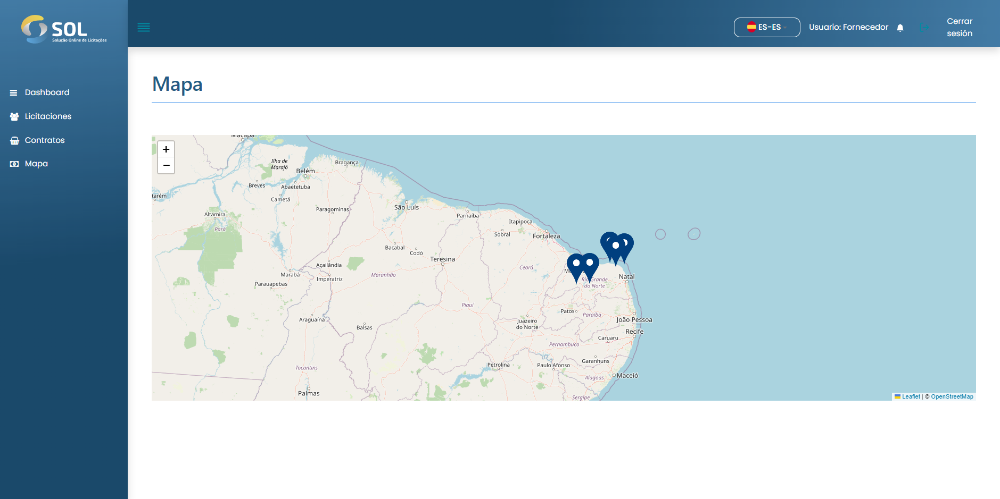

# Mapa

Se puede acceder a la pantalla "Mapas" a través de su pestaña en el menú principal del Sistema. En ella, se indican las localidades de las Asociaciones registradas en el Sistema (puntos en azul), además de su propia ubicación (punto en verde). Al pulsar sobre una de ellas, se muestra su nombre.

<figure><figcaption></figcaption></figure>
